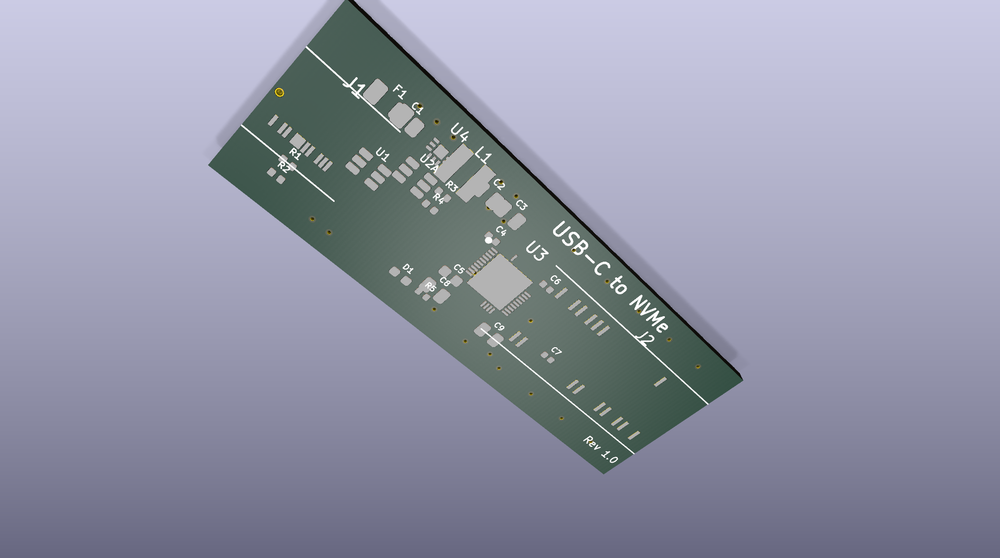

# KiCad MCP Server

KiCad 9.x 的 MCP (Model Context Protocol) 服务器，通过 Claude Code 或其他 MCP 客户端实现 AI 辅助 PCB 设计。

[](https://www.gnu.org/licenses/gpl-3.0)
[](https://www.python.org/downloads/)
[](https://www.kicad.org/)

[English](./README.md)

## ✨ v3.5.0 新特性

- **🏗️ 模块化架构** - 从 987 行单文件重构为清晰的包结构
- **🔒 安全加固** - 路径验证、注入防护、文件访问限制
- **⚙️ 环境变量配置** - 所有设置可通过环境变量配置
- **🧹 任务清理** - 新增 `cleanup_tasks` 工具管理旧任务
- **✅ 单元测试** - 55 个全面测试覆盖核心功能
- **📝 类型注解** - 全代码库类型提示
- **📊 日志框架** - 结构化日志系统替代 stderr 打印

## 功能特性

- **DRC/ERC 检查** - 设计规则检查和电气规则检查
- **Zone 填充** - 自动铜皮填充
- **自动布线** - 集成 FreeRouting，支持异步（绕过 10 分钟超时限制）
- **3D 渲染** - KiCad 9 原生 3D 渲染（顶部/底部/等角视图）
- **导出** - Gerber、钻孔、BOM、网表、PDF、SVG、STEP
- **JLCPCB 打包** - 完整的嘉立创制造文件包

## 架构

```
本地机器                          VPS (KiCad 9.x)
┌─────────────────┐              ┌─────────────────────┐
│  Claude Code    │     MCP      │  MCP Server v3.5.0  │
│  或 MCP 客户端  │◄────SSH─────►│  kicad-cli + pcbnew │
└─────────────────┘              │  + FreeRouting      │
                                 └─────────────────────┘
```

## 环境要求

### VPS
- Ubuntu 22.04+ 或 Debian 12+
- KiCad 9.0.6+
- Python 3.10+
- Java 17+ (FreeRouting 需要)
- xvfb (无头渲染需要)

### 本地
- 支持 MCP 的 Claude Code
- SSH 访问 VPS

## 快速安装

### VPS 端

```bash
# 克隆仓库
git clone https://github.com/bunnyf/pcb-mcp.git
cd pcb-mcp

# 运行安装脚本
chmod +x scripts/install.sh
./scripts/install.sh
```

或手动安装：

```bash
# 安装 KiCad 9
sudo add-apt-repository ppa:kicad/kicad-9.0-releases -y
sudo apt update
sudo apt install kicad xvfb -y

# 安装 FreeRouting
sudo apt install openjdk-17-jre -y
sudo wget -q https://github.com/freerouting/freerouting/releases/download/v1.9.0/freerouting-1.9.0.jar -O /opt/freerouting.jar

# 设置 MCP Server
mkdir -p /root/pcb/{mcp,projects,tasks}
cp kicad_mcp_server.py /root/pcb/mcp/
chmod +x /root/pcb/mcp/kicad_mcp_server.py
```

### Claude Code 配置

在 Claude Code MCP 设置中添加 (`~/.claude/claude_desktop_config.json`):

```json
{
  "mcpServers": {
    "kicad": {
      "command": "ssh",
      "args": [
        "your-vps-host",
        "python3 /root/pcb/mcp/kicad_mcp_server.py"
      ]
    }
  }
}
```

## 可用工具 (23 个)

### 检查类
| 工具 | 描述 |
|------|------|
| `run_drc` | PCB 设计规则检查 |
| `run_erc` | 原理图电气规则检查 |

### 操作类
| 工具 | 描述 |
|------|------|
| `fill_zones` | 填充所有铜皮区域 |
| `auto_route` | FreeRouting 自动布线 (异步) |

### 异步任务
| 工具 | 描述 |
|------|------|
| `get_task_status` | 查询异步任务状态 |
| `list_tasks` | 列出所有异步任务 |
| `cleanup_tasks` | 清理旧的已完成/失败任务 |

### 信息类
| 工具 | 描述 |
|------|------|
| `list_projects` | 列出所有项目 |
| `get_board_info` | 板子尺寸、层数、元件数 |
| `get_output_files` | 列出输出文件 |
| `get_version` | 版本信息 |

### PCB 导出
| 工具 | 描述 |
|------|------|
| `export_gerber` | Gerber + 钻孔文件 |
| `export_3d` | 3D 渲染图 (top/bottom/iso/all) |
| `export_svg` | PCB SVG 图片 |
| `export_pdf` | PCB PDF |
| `export_step` | STEP 3D 模型 |

### 原理图导出
| 工具 | 描述 |
|------|------|
| `export_bom` | BOM 物料清单 (CSV) |
| `export_netlist` | 网表 (KiCad XML/SPICE) |
| `export_sch_pdf` | 原理图 PDF |
| `export_sch_svg` | 原理图 SVG |

### 生产制造
| 工具 | 描述 |
|------|------|
| `export_jlcpcb` | 完整嘉立创文件包 |
| `export_all` | 导出所有文件 |

### 文件操作
| 工具 | 描述 |
|------|------|
| `read_file` | 读取文件内容 |

## 完整示例项目

### 🎯 USB NVMe 适配器

一个**生产就绪的 PCB 设计**，完全使用 KiCad MCP Server + Claude Code 创建：

- **设计**: USB-C 转 M.2 NVMe 适配器（4 层 PCB）
- **工作流**: 100% AI 辅助设计，无需本地 EDA 软件
- **组件**: ASM2362 桥接芯片、TPS62913 DC-DC、USB-C 连接器
- **输出**: 制造文件、3D 渲染图、完整文档

查看完整示例：[examples/usb_nvme_adapter](./examples/usb_nvme_adapter/)



## 使用示例

### 基本工作流

```
用户: 列出项目
AI: [调用 list_projects]

用户: 检查 DRC my_board
AI: [调用 run_drc project="my_board"]

用户: 生成 3D 渲染图
AI: [调用 export_3d project="my_board" view="all"]

用户: 导出嘉立创文件
AI: [调用 export_jlcpcb project="my_board"]
```

### 自动布线（异步）

```
用户: 自动布线 my_board
AI: [调用 auto_route] 
    → 返回 task_id: "route_my_board_20241231_101530"

用户: 查看布线进度
AI: [调用 get_task_status task_id=...]
    → {"status": "started", "log_tail": "..."}

# 完成后:
AI: [调用 get_task_status]
    → {"status": "completed", "message": "自动布线完成！"}
```

## 输出目录结构

```
project/output/
├── gerber/      # Gerber + 钻孔文件
├── bom/         # BOM CSV
├── netlist/     # 网表文件
├── 3d/          # 3D 渲染图 (PNG) + STEP 模型
├── images/      # SVG 图片
├── docs/        # PDF 文档
├── reports/     # DRC/ERC 报告 (JSON)
├── jlcpcb/      # 完整嘉立创文件包
└── backup/      # 自动布线前备份
```

## 项目同步

使用 rsync 在本地和 VPS 之间同步项目：

```bash
# 上传到 VPS
rsync -avz ~/pcb/my_board/ vps:/root/pcb/projects/my_board/

# 从 VPS 下载
rsync -avz vps:/root/pcb/projects/my_board/output/ ~/pcb/my_board/output/
```

## 配置

所有服务器设置都可以通过环境变量配置。详见 [`.env.example`](./.env.example)。

### 主要环境变量

```bash
# 基础目录
KICAD_MCP_PROJECTS_BASE=/root/pcb/projects
KICAD_MCP_TASKS_DIR=/root/pcb/tasks

# 外部工具
KICAD_MCP_KICAD_CLI=kicad-cli
KICAD_MCP_FREEROUTING_JAR=/opt/freerouting.jar

# 超时设置（秒）
KICAD_MCP_DEFAULT_TIMEOUT=300
KICAD_MCP_AUTOROUTE_TIMEOUT=600

# 文件限制
KICAD_MCP_MAX_FILE_SIZE=10485760  # 10MB

# 渲染设置
KICAD_MCP_RENDER_WIDTH=1920
KICAD_MCP_RENDER_HEIGHT=1080

# 任务清理
KICAD_MCP_TASK_MAX_AGE_DAYS=7
```

## 安全特性

v3.5.0 包含全面的安全加固：

- **路径验证** - 防止目录遍历攻击
- **文件访问限制** - `read_file` 工具仅限访问 projects/tasks 目录
- **Shell 注入防护** - 所有动态脚本生成使用 `shlex.quote()`
- **输入验证** - 项目名称经过清理以防止路径操纵
- **安全命令执行** - 带超时保护的正确子进程处理

## 开发

### 运行测试

```bash
# 安装开发依赖
pip3 install -r requirements.txt

# 运行测试
pytest tests/ -v

# 运行覆盖率测试
pytest tests/ --cov=kicad_mcp_server --cov-report=html
```

### 代码质量

```bash
# 类型检查
mypy kicad_mcp_server/

# 代码检查
ruff check kicad_mcp_server/
```

## 许可证

GNU General Public License v3.0 或更高版本 - 参见 [LICENSE](./LICENSE)

## 贡献

欢迎提交 Issues 和 PRs！

## 致谢

- [KiCad](https://www.kicad.org/) - 开源 EDA
- [FreeRouting](https://github.com/freerouting/freerouting) - 开源 PCB 自动布线器
- [Anthropic](https://www.anthropic.com/) - Claude AI 和 MCP 协议
